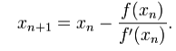
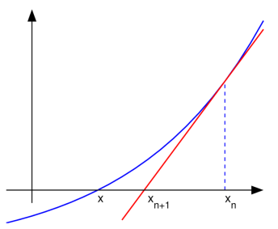
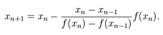
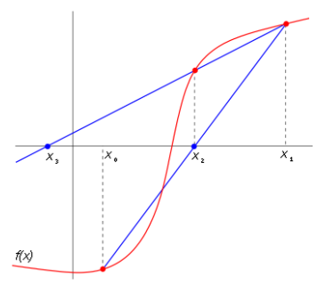

## Método numérico de la secante

En análisis numérico el método de la secante es un
método para encontrar los ceros de una función de
forma iterativa.

Es una variación del método de Newton-Raphson,

 

donde en vez de calcular la derivada de la función en el punto
de estudio teniendo en mente la definición de
derivada, se aproxima la pendiente a la recta que une la
función evaluada en el punto de estudio y en el punto
de la iteración anterior. Este método es de especial
interés cuando el coste computacional de derivar la
función de estudio y evaluarla es demasiado elevado,
por lo que el método de Newton no resulta atractivo.

En otras palabras, el método de la secante es un
algoritmo de la raíz de investigación que utiliza una
serie de raíces de las líneas secantes para aproximar
mejor la raíz de una función f. El método de la secante
se puede considerar como una aproximación en
diferencias finitas del método de Newton-Raphson. Sin
embargo, este método fue desarrollado
independientemente de este último.
