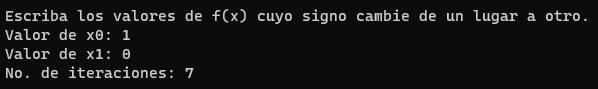

## Instrucciones de uso

El programa arracará dándote una breve bienvenida e inmediatamente te solicitara una serie de datos para que empiece a trabajar. Junto con la bienvenida vendrá una función por defecto a evaluar (la función puede cambiarse en el código funete).

 - La primera petición son los datos de tabulación.

   

 Usted deberá proporcinar un rango para que el programa tabule, por lo cual debe razonar el número de tabulaciones que desea ver, por ejémplo, si su rango es de 4 a -4 entonces el número de tabulaciones debe se 9. En cuanto al fix se refiere al número de decimales que quiere que salgan después del 0. Enseguida se mostrarán los resultados

- Proporcionar valores de x0 y x1

El siguiente paso es observar la tabla que tabulación y darle a la computadora dos valores, estos son los valore de x cuyos respectivos valores de f(x) cambien de signo de un lugar a otro, en la imagen podemos ver que los valores a escribir son 1 y 0 o 0 y -1.

También debe proporcionar un número de iteraciones, preferentemente ingrese 8 iteraciones.

Una vez ingrese el número de iteraciones el programa se va a ejecutar, hará las operaciones correspondientes y mostrará un resultado final maracado con la palabra solución junto con una tabla de resultados evaluando la función en los valores que ingresó.

Después de mostrar la solución, aparecerá una leyenda con instrucciones de cómo volver a usar el programa y también se mencionará qué líneas de código deben modificarse para cambiar la función.

